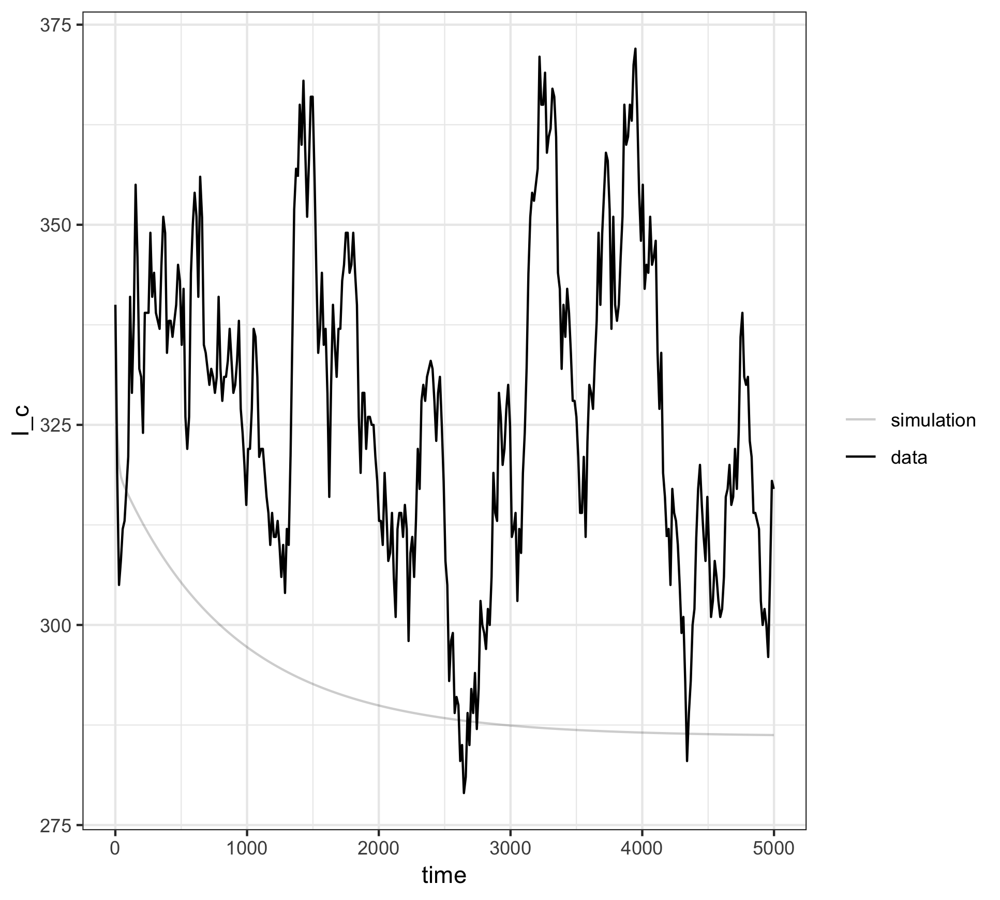
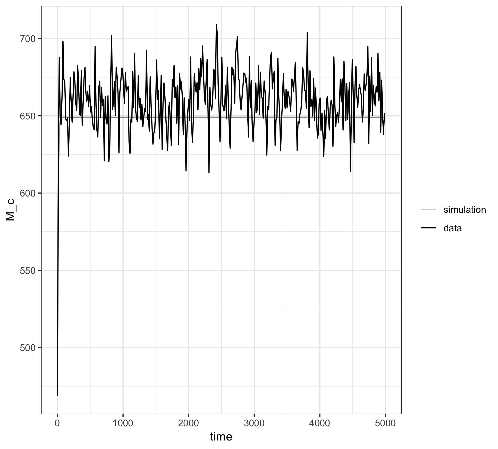
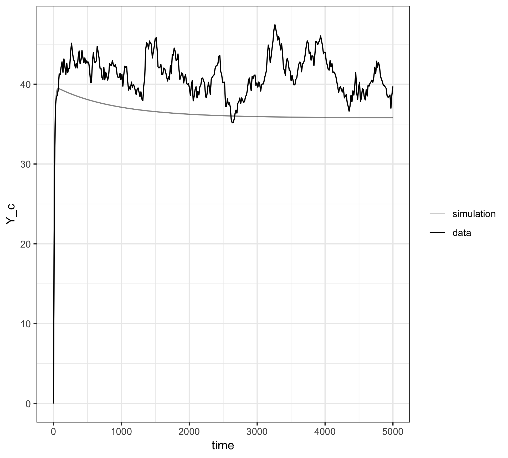

Ross\_Iterated\_Filtering
================
Zhanhao Zhang
May 9, 2019

References
----------

[Getting Started With Pomp](https://kingaa.github.io/pomp/vignettes/getting_started.html)

How this works?
---------------

The Iterated Filtering algorithm is an Expectation Maximization (EM) based algorithm. It first generates a list of particles. For each of the particle, it starts with an initial guess (within a specified range) of the values for the missing pa- rameters. Then, for each subsequent iterations, it first figure out the estimated values of the time series data using the current guess of the parameter values; then it calculates the likelihood of this set of parameter values based on the original data and the estimated values. Finally, weighting on the likelihood of each particle, it samples the parameter values again for each particle, and then go through the same process. The number of iterations has to be specified by users as well. Usually if the number of iterations is large enough, then all of the particles will converge to the set of parameter values that fit the data best. The output will be the set of parameter values that have the highest likelihood (a.k.a the MLE).

Required Inputs
---------------

data: a csv with one column for time and some other columns for variables.
hyper-parameters:
  dmeasure: probability of Y given X, where X is an observed variable, and Y is a hidden variable. In our case with Ross-Macdonald model, however, there is not a hidden variable. In order to get pomp work, we need to let Y = X, which means Y is the true (observed) value of X, whereas X is the estimated value using our model, and dmeasure now actually tells the deviation of estimated value of X from its originally observed value. The larger the deviation, the lower value dmeasure will return. <br>   rmeasure: the random process of generating Y using X. As with the case of dmeasure, Y = X in this case. <br>   Np: number of particles <br>   Nmif: number of iterations <br>   rw.sd: 0 for parameters that are constant, &gt; 0 for parameters we want to fit. <br>         It also determines the step size of each parameter during the training.

Packages Required
-----------------

``` r
library(pomp2)
library(magrittr)
library(subplex)
library(foreach)
library(doParallel)
library(ggplot2)
library(dplyr)
```

Demo (Ross-Macdonald Model)
---------------------------

Registers workers (for parallel programming), change the 4 to a larger number if you have a more powerful computer.

``` r
# Registers workers, change the 4 to a larger number if you
# have a more powerful computer.
registerDoParallel(cores=4)
```

Read the data

``` r
output_read <- read.csv("output1.csv")
```

The column names of data should be different from the statenames which is required by pomp

``` r
colnames(output_read) <- c("time", "M_c", "Y_c", "Z_c", "I_c")
statenames <- c("M", "Y", "Z", "I", "K", "ER")
paranames <- c("p", "a", "l", "r", "b", "H", "E", "c")
```

parameter values

``` r
params <- c(E=11, r=0.005, b=0.55, a=0.27, c=0.15, H=2000)
```

initial values for each variable
K and ER are helper variables that are needed in the step function

``` r
Csnippet("M=468.9; Y=0; Z=0; I=340;K=0; ER=0;") -> init
```

step functions
the variables will be updated accordingly at each time step

step function -- stochastic version
using [pseudocode](https://github.com/smitdave/MASH-Main/blob/master/MASH-dev/DanielCitron/RM-Macro/RM-macro.pdf)

``` r
Csnippet("
  M += l;
  M *= p;
  Y *= p;
  double Y_0 = a*K*(M-Y);
  Y += Y_0;
  Z = pow(p, E)*Y;
  I = I - r*I + b*ER*(H - I);

  I = I > 0 ? I : 0;
  M = M > 0 ? M : 0;
  Y = Y > 0 ? Y : 0;
  Z = Z > 0 ? Z : 0;

  K = c*I/H;
  ER = a*Z/H;
") -> step
```

step function -- deterministic version <br> converted from Ross-Macdonald equation, approximated using taylor expansion<br> *An important thing to notice here is that Csnippet does not allow us to use non-primitive types. For instance, do not try to malloc an array inside the Csnippet, or try to pass in a vector as parameter.*

``` r
Csnippet("
  double di1 = r*dt*I;
  double di2 = b*ER*(H-I)*dt;
  double dm1 = p*M*dt;
  double dm2 = -l*(1+p*dt)*dt;
  double dy1 = p*Y*dt;
  double dy2 = a*K*(M-Y)*dt;
  double dz1 = p*Z*dt;
  double dz2 = a*K*(M-Y)*dt;
  
  I += di1 - di2;
  M += dm1 - dm2;
  Y += dy1 - dy2;
  Z += dz1 - dz2;

  I = I > 0 ? I : 0;
  M = M > 0 ? M : 0;
  Y = Y > 0 ? Y : 0;
  Z = Z > 0 ? Z : 0;

  K = c*I/H;
  ER = a*Z/H;
") -> step_det
```

rmeasure, indicates how each variable in the data are generated from the data we are estimating. In this case, each variable we estimate should be the same as the corresponding variable in the original data.

``` r
Csnippet("I_c=I; M_c=M; Y_c = Y; Z_c = Z;") -> rmeas
```

dmeasure, tells the likelihood of each set of estimated values
Here, I assume they should center around the value in the original data
The farther they are from the original data, the less likely it is

``` r
Csnippet("
         double di = dnorm(I - I_c, 0, 10, 0);
         double dm = dnorm(M - M_c, 0, 10, 0);
         double dy = dnorm(Y - Y_c, 0, 10, 0);
         double dz = dnorm(Z - Z_c, 0, 10, 0);
         lik = di*dm*dy*dz;") -> dmeas
```

Construct a pomp object

initialize pomp with the Csnippets we defined in the previous part <br> the step function above should be placed into discrete\_time() following the rprocess<br> rinit requires for the init function, while rmeasure requires the rmeasure function

``` r
output_read %>%
  pomp(
    times="time", t0=0,
    rinit=init, rmeasure=rmeas,
    rprocess=discrete_time(step,delta.t=1),
    statenames=statenames,
    paramnames=paranames
  ) -> output_pomp
```

Code the deterministic skeleton, which is identical to our ODE, since we don't have random variables directly appears in the ODE<br> We are required to specify the skeleton function to get pomp work, though the pomp will only use the step function we created earlier to integrate the trajectories.

``` r
output_pomp %>%
  pomp(
    skeleton=map(
      Csnippet("DM=l*(1-p)-p*M; DY=a*K*(M-Y)-p*Y;
                DZ=pow(p, E)*DY;DI=b*ER*(H-I)-r*I;"),
      delta.t=1
    ),
    paramnames=paranames,
    statenames=statenames
  ) -> output_pomp
```

Estimate the parameters using the subplex package Currently I don't use it anymore, but I leave it here for debugging If this function gives an output without error messages, then we haven't made any syntactic errors in the previous parts

``` r
output_pomp %>%
  traj_objfun(
    est=c("p", "l"),
    params=c(params,p=1, l=1),
    dmeasure=dmeas, statenames=statenames
  ) -> ofun

subplex(c(1.1, 1.1),fn=ofun) -> fit
fit 
```

Generate nseq number of random guesses of each paramter with their lower bound and upper bound<br> For the paramters we passed in as constants (eg. N) We can just set both of their lower and upper bounds to their values (eg. N = 500)<br> sobolDesign is a function in pomp used for generating random guesses for each parameter within their ranges

``` r
sobolDesign(
  lower=c(p=0, l=0, E=11, r=0.005, b=0.55, a=0.27, c=0.15, H=2000),
  upper=c(p=1, l=100, E=11, r=0.005, b=0.55, a=0.27, c=0.15, H=2000),
  nseq=200
) -> guesses
```

Initialize the object for particle filter using random guesses we generated<br>
Np is the number of particles we use <br> Nmif is the number of iterations <br> rw.sd is the standard deviation of a paramter when sample it in the particle filter algorithm <br> rw.sd of a constant should be set to 0, so that its value won't change<br>

``` r
output_pomp %>%
  mif2(
    params=guesses[1,],
    Np=200,
    Nmif=150,
    dmeasure=dmeas,
    partrans=parameter_trans(log=c("p", "a", "l", "r", "b", "H", "E", "c")),
    cooling.fraction.50=0.5,
    rw.sd=rw.sd(E=0, r=0, b=0, a=0, c=0, H=0, p=0.01, l=0.01),
    paramnames=paranames,
    statenames=statenames,
    filter.traj=TRUE,
    pred.mean=TRUE,
    pred.var=TRUE
  ) -> mf1
```

Do a global search

``` r
foreach(guess=iter(guesses, "row"),
        .combine=c, .packages=c("pomp2"),
        .errorhandling="remove", .inorder=FALSE) %dopar% {
          mf1 %>% mif2(params=guess)
        } ->mifs
```

Get the likelihood of these estimates

``` r
foreach (mf=mifs,
         .combine=rbind, .packages=c("pomp2"), 
         .errorhandling="remove", .inorder=FALSE) %dopar% {
           
           replicate(5, 
                     mf %>% pfilter() %>% logLik()
           ) %>%
             logmeanexp(se=TRUE) -> ll
           
           data.frame(as.list(coef(mf)),loglik=ll[1],loglik.se=ll[2])
           
         } -> estimates
```

More search efforts

``` r
estimates %>% select(-loglik, -loglik.se) -> starts
foreach (start=iter(starts,"row"),
         .combine=rbind, .packages=c("pomp2"),
         .errorhandling="remove", .inorder=FALSE) %dopar% {
           
           mf1 %>%
             mif2(
               params=start,
               partrans=parameter_trans(log=c("p", "a", "l", "r", "b", "H", "E", "c")),
               rw.sd=rw.sd(E=0, r=0, b=0, a=0, c=0, H=0, p=0.01, l=0.01),
               paramnames=paranames
             ) %>%
             mif2() -> mf
           
           replicate(5, 
                     mf %>% pfilter() %>% logLik()
           ) %>%
             logmeanexp(se=TRUE) -> ll
           
           data.frame(as.list(coef(mf)),loglik=ll[1],loglik.se=ll[2])
         } -> r_prof
```

Get the MLE and draw the simulation plots

``` r
r_prof[which.max(r_prof[,9]),][1:8] -> mle

mlepomp <- as(mifs[[1]], 'pomp')
coef(mlepomp) <- mle

mlepomp2 <- as(mifs2[[1]], 'pomp')
coef(mlepomp2) <- mle

# Simulation plots for I
mlepomp %>%
  simulate(nsim=1,format="data.frame",include.data=TRUE) %>%
  ggplot(mapping=aes(x=time,y=I_c,group=.id,alpha=(.id=="data")))+
  scale_alpha_manual(values=c(`TRUE`=1,`FALSE`=0.2),
                     labels=c(`FALSE`="simulation",`TRUE`="data"))+
  labs(alpha="")+
  geom_line()+
  theme_bw()
ggsave("plots/sim_I_dt=1_Nmif=150_Np=200.png")
# Simulation plots for M
mlepomp %>%
  simulate(nsim=3,format="data.frame",include.data=TRUE) %>%
  ggplot(mapping=aes(x=time,y=M_c,group=.id,alpha=(.id=="data")))+
  scale_alpha_manual(values=c(`TRUE`=1,`FALSE`=0.2),
                     labels=c(`FALSE`="simulation",`TRUE`="data"))+
  labs(alpha="")+
  geom_line()+
  theme_bw()
ggsave("plots/sim_M_dt=1_Nmif=150_Np=200.png")
# Simulation plots for Y
mlepomp %>%
  simulate(nsim=3,format="data.frame",include.data=TRUE) %>%
  ggplot(mapping=aes(x=time,y=Y_c,group=.id,alpha=(.id=="data")))+
  scale_alpha_manual(values=c(`TRUE`=1,`FALSE`=0.2),
                     labels=c(`FALSE`="simulation",`TRUE`="data"))+
  labs(alpha="")+
  geom_line()+
  theme_bw()
ggsave("plots/sim_Y_dt=1_Nmif=150_Np=200.png")
# Simulation plots for Z
mlepomp %>%
  simulate(nsim=3,format="data.frame",include.data=TRUE) %>%
  ggplot(mapping=aes(x=time,y=Z_c,group=.id,alpha=(.id=="data")))+
  scale_alpha_manual(values=c(`TRUE`=1,`FALSE`=0.2),
                     labels=c(`FALSE`="simulation",`TRUE`="data"))+
  labs(alpha="")+
  geom_line()+
  theme_bw()
ggsave("plots/sim_Z_dt=1_Nmif=150_Np=200.png")
```

The graphs are below. For the sake of runtime, I haven't got a chance to see the perfectly fitted lines for this dataset. Increasing Np and Nmif will improve the performance, which is demonstrated by some experiments on smaller datasets. 
