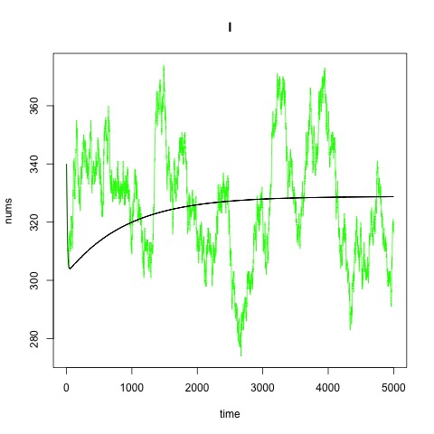
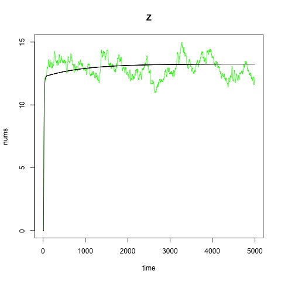

## References
[Learning R: Parameter Fitting for Models Involving Differential Equations](https://www.r-bloggers.com/learning-r-parameter-fitting-for-models-involving-differential-equations/)

## How it works?
The Least Square Method is a more straight forward algorithm. Its basic idea is to come up with a set of parameters, using which we can generate the estimated values for each variable in a time series that have the least square error from the original data.

## Required Inputs
data: a csv with one column for time and some other columns for variables.  
hyper-parameters:  
&nbsp;&nbsp;number of initial guesses

```{r setup, eval=FALSE, echo=FALSE}
knitr::opts_chunk$set(echo = TRUE)
```

## Packages Required
```{r, eval=FALSE}
library(ggplot2)
library(reshape2)
library(deSolve)
library(minpack.lm)
library(foreach)
library(doParallel)
library(pomp2)
```

## Demo (Ross-Macdonald Model)

Registers workers (for parallel programming), change the 4 to a larger number if you have a more powerful computer.
```{r,eval=FALSE}
registerDoParallel(cores=4)
```

Read the data
```{r,eval=FALSE}
ross_read <- read.csv("output1.csv")
```

Set the known parameter values
```{r,eval=FALSE}
E = 11
r = 0.005
b = 0.55
a = 0.27
c = 0.15
H = 2000
```

Step function--discrete version using [pseudocode](https://github.com/smitdave/MASH-Main/blob/master/MASH-dev/DanielCitron/RM-Macro/RM-macro.pdf)  <br>
takes in parameter values p and l  <br>
output a dataframe containing estimated values for each variable at each time
```{r,eval=FALSE}
get_sim_df <- function(p, l, end_t){
  output_df <- data.frame(time=0, M=468.9, Y=0, Z=0, I=340)
  Kappa <- c*output_df[1,]$I/H
  ER <- a*output_df[1,]$Z/H
  ZZ <- rep(0, E + 1)
  for(i in 1:end_t){
    prev_row <- output_df[i, ]
    M <- prev_row$M + l
    M <- p*M
    Y <- p*prev_row$Y
    Y0 <- a*Kappa*(M - Y)
    Y <- Y + Y0
    Z <- p*prev_row$Z
    Z <- Z + ZZ[1]
    for(j in 1:E){
      ZZ[j] = ZZ[j + 1]
    }
    ZZ[E + 1] = (p^E)*Y0
    I <- prev_row$I - r*prev_row$I + b*ER*(H - prev_row$I)
    Kappa <- c*I/H
    ER <- a*Z/H
    output_df <- rbind(output_df, data.frame(time=i, M=M, Y=Y, Z=Z, I=I))
  }
  return(output_df)
}
```

Step function--continuous version  <br>
t: all possible values of time from the dataset  <br>
y: a vector storing values of each variable at a certain time  <br>
parms: stores the parameter values, p and l  <br>
output a list containing rates for each variable at a given time (i.e for variable X, the list contains the value for dX/dt)
```{r, eval=FALSE}
rxnrate <- function(t, y, parms){
  p <- parms$p
  l <- parms$l
  
  re <- rep(0, 4)
  ER <- a*y["Z"]/H
  K <- c*y["I"]/H
  
  re[1] = l-p*y["M"]
  re[2] = a*K*(y["M"]-y["Y"])-p*y["Y"]
  re[3] = re[2]*exp(-p*E)
  re[4] = b*ER*(H-y["I"])-r*y["I"]
  
  return(list(re))
}
```

Uses the discrete step function  <br>
outputs a dataframe containing the difference between the estimated values and the observed values of each variable at each time
```{r,eval=FALSE}
ssq <- function(params){
  p <- params[1]
  l <- params[2]
  
  out_df <- get_sim_df(p, l, 5000)
  preddf <- melt(out_df, id.var="time", variable.name="types", 
                 value.name = "nums")
  expdf <- melt(as.data.frame(ross_read), id.var = "time",
                variable.name="types", value.name = "nums")
  
  return(preddf$nums - expdf$nums)
}
```

Uses the continuous step function (generating estimated values using ode in r)  <br>
outputs a dataframe containing the difference between the estimated values and the observed values of each variable at each time
```{r, eval=FALSE}
ssq <- function(params){
  states_init <- c(M=468.9, Y=0, Z=0, I=340)
  t <- ross_read$time
  
  p <- params[1]
  l <- params[2]
  
  out <- ode(y = states_init, times = t, func = rxnrate, 
             parms = list(p=p, l=l), method="euler")
  out_df <- data.frame(out)
  out_df <- out_df[out_df$time %in% ross_read_des_partial$time,]
  preddf <- melt(out_df, id.var="time", variable.name="types", 
                 value.name = "nums")
  expdf <- melt(as.data.frame(ross_read_des_partial), id.var = "time",
                variable.name="types", value.name = "nums")
  
  return(preddf$nums - expdf$nums)
}
```

The least square method for non-linear functions, however, does not guarantee a global optimal solution, so it is safer to randomly generating many initial guesses for the parameter p and l (in this case, we genereate 100 initial guesses), and then apply each of them to the least square algorithm (nls.lm in r), and pick the one with least deviance  
par stores the set of parameter values with least deviance we have found
```{r, eval=FALSE}
sobolDesign(
  lower=c(p=0, l=0),
  upper=c(p=1, l=100),
  nseq=100
) -> guesses
foreach(guess=iter(guesses, "row"), 
        .errorhandling="remove", .inorder=FALSE,
        .combine = rbind) %dopar% {
          params <- c(p = guess$p, l = guess$l)
          fitval <- nls.lm(par=params, fn=ssq, lower = c(p=0, l=0),
                           upper = c(p=1, l=100))
          c(fitval)
        } -> all_fits
min <- all_fits[1,]$deviance
index <- 1
for(i in 2:nrow(all_fits)){
  if(all_fits[i,]$deviance < min){
    min <- all_fits[i,]$deviance
    index <- i
  }
}
par <- all_fits[index,]$par
par
```

Calculating the confidence interval for each estimated parameter value
```{r, eval=FALSE}
stdv <- sqrt(diag(solve(all_fits[index,]$hessian)))
par[1] + c(-1, 1)*1.96*stdv[1]
par[2] + c(-1, 1)*1.96*stdv[2]
```

Using the fitted values of parameters  
Plot the trajectories of fitted curves VS original curves for each variable
```{r, eval=FALSE}
# Plot
out_df <- get_sim_df(par$p, par$l, 5000)

jpeg("plots/ross_M_whole_step_dt=1.jpeg")
plot(ross_read$time, ross_read$M, main="M",
     xlab="time", ylab="nums", type="l", col="green")
lines(out_df$time, out_df$M, col="black")
dev.off()

jpeg("plots/ross_Y_whole_step_dt=1.jpeg")
plot(ross_read$time, ross_read$Y, main="Y",
     xlab="time", ylab="nums", type="l", col="green")
lines(out_df$time, out_df$Y, col="black")
dev.off()

jpeg("plots/ross_Z_whole_step_dt=1.jpeg")
plot(ross_read$time, ross_read$Z, main="Z",
     xlab="time", ylab="nums", type="l", col="green")
lines(out_df$time, out_df$Z, col="black")
dev.off()

jpeg("plots/ross_I_whole_step_dt=1.jpeg")
plot(ross_read$time, ross_read$I, main="I",
     xlab="time", ylab="nums", type="l", col="green")
lines(out_df$time, out_df$I, col="black")
dev.off()
```

The plots are below.<br>
```{r, echo=FALSE}




```